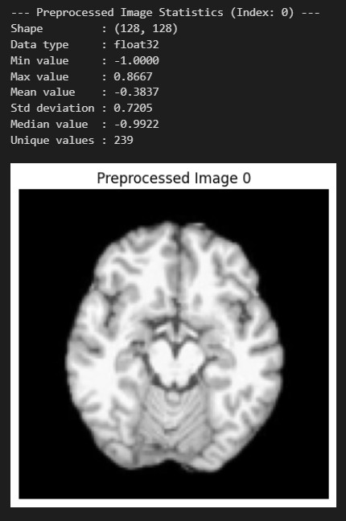
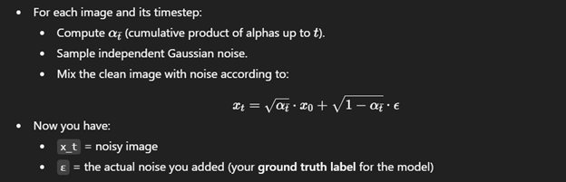
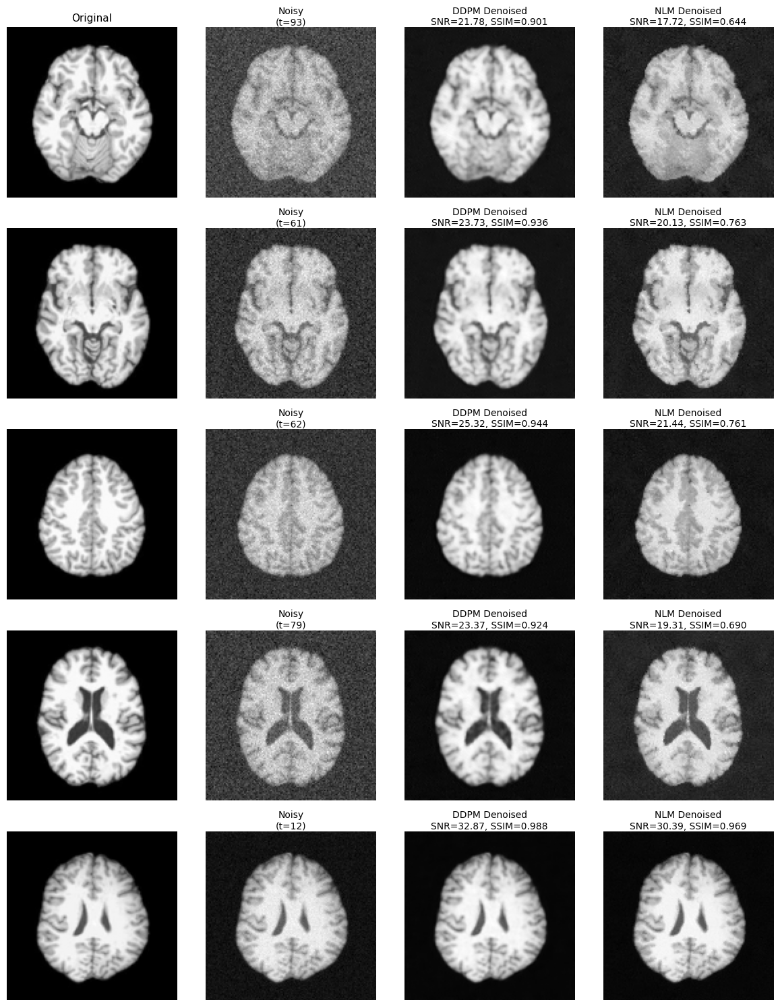

# Denoising MRI Scans using Denoising Diffusion Probabilistic Models (DDPMs)

This project explores the application of Denoising Diffusion Probabilistic Models (DDPMs) for denoising 2D medical MRI scans while preserving crucial diagnostic details. The implementation fine-tunes a pre-trained DDPM on the `IXI2D` dataset and provides a comprehensive evaluation by comparing its performance against the traditional Non-Local Means (NLM) algorithm using metrics like Signal-to-Noise Ratio (SNR) and Structural Similarity Index (SSIM).

## Features

*   **DDPM for Denoising:** Leverages a diffusion model to remove noise from MRI images.
*   **Fine-Tuning:** Fine-tunes a pre-trained UNet from the `benetraco/brain_ddpm_128` Hugging Face model.
*   **Performance Evaluation:** Quantitatively assesses denoising quality using SNR and SSIM metrics.
*   **Comparative Analysis:** Benchmarks the DDPM's performance against the classical Fast Non-Local Means (NLM) algorithm.
*   **Efficient Training:** Utilizes Hugging Face `accelerate` for mixed-precision (FP16) training and `diffusers` for model handling.
*   **End-to-End Workflow:** The entire process, from data loading to evaluation, is contained within a single Jupyter Notebook.

## Methodology

The denoising process is structured into the following key stages:

1.  **Data Preparation:**
    *   The `iamkzntsv/IXI2D` dataset is loaded from the Hugging Face hub.
    *   Images are resized to 128x128, converted to grayscale, and normalized to a `[-1, 1]` range.
    *   The dataset is split into training and testing sets, which are then saved to disk as PyTorch tensors for efficient loading.
      
      #### Preprocessed Brain MRI Slice Sample with Descriptive Statistics
      

2.  **Forward Diffusion:**

    *   A linear beta schedule (`β_t`) is defined to control the variance of Gaussian noise added at each timestep `t`.
    *   The forward process gradually corrupts clean images `x_0` into noisy images `x_t` over `T` timesteps according to the closed-form formula: `x_t = sqrt(ᾱ_t) * x_0 + sqrt(1 - ᾱ_t) * ε`, where `ε` is Gaussian noise.


      #### Forward Diffusion (Closed Form Equation)
      


4.  **Model and Training:**
    *   A pre-trained UNet model (`benetraco/brain_ddpm_128`) is used as the noise predictor.
    *   The model is fine-tuned on the noisy training data. Its objective is to predict the noise `ε` that was added to a clean image `x_0` at a given timestep `t`.
    *   The optimization is based on minimizing the Mean Squared Error (MSE) between the predicted noise and the actual noise.
    *   The training loop is managed by Hugging Face `accelerate`, enabling features like mixed-precision training and seamless device placement.

5.  **Denoising and Evaluation:**
    *   Denoising is the reverse process. Starting with a noisy image, the model predicts the noise, which is used to estimate a slightly less noisy image. This is repeated until an estimate of the clean image is obtained.
    *   The performance of the DDPM and NLM algorithms is evaluated on the test set.
    *   Final results are compared both quantitatively (using SNR and SSIM in a table) and qualitatively (through side-by-side image visualizations).

## Results

The model is evaluated by adding noise to test images and then using both the fine-tuned DDPM and the NLM algorithm to denoise them. 
The results demonstrate the DDPM's superior ability to reconstruct the original image while preserving fine details compared to the NLM method.

The evaluation metrics are presented in a summary table:

```
=== Evaluation Metrics ===
+--------+----------+---------+
| Method | SNR (dB) | SSIM    |
+========+==========+=========+
| DDPM   | 25.47568 | 0.9432  |
+--------+----------+---------+
| NLM    | 21.6638  | 0.7897  |
+--------+----------+---------+
```
*(Note: Values are representative examples from a sample run and may vary.)*

Visual comparisons further highlight the DDPM's effectiveness, showing cleaner reconstructions with fewer artifacts than those produced by NLM. 
The notebook generates side-by-side comparisons of the original, noisy, DDPM-denoised, and NLM-denoised images, complete with per-image metric calculations.

#### Denoising Results Sample for DDPM vs NLM (benchmark)


## Getting Started

### Prerequisites
Ensure you have a Python environment with the necessary packages installed. 
A CUDA-enabled GPU is highly recommended for reasonable training times.

```bash
pip install torch torchvision 
pip install diffusers transformers accelerate datasets scikit-learn scikit-image tabulate matplotlib pillow
```

### Running the Project
The entire workflow is encapsulated in the `CSE681_DIP_Project.ipynb` Jupyter Notebook.

1.  **Clone the repository:**
    ```bash
    git clone https://github.com/halashaheen/mri-scans-denoising-using-ddpm.git
    cd mri-scans-denoising-using-ddpm
    ```

2.  **Open and run the notebook:**
    Open `CSE681_DIP_Project.ipynb` in a Jupyter environment (like Jupyter Lab or Google Colab).

3.  **Execute the cells:**
    Run the cells sequentially. The notebook will automatically:
    *   Check for GPU availability.
    *   Download and split the `IXI2D` dataset.
    *   Preprocess and save the data locally.
    *   Load the pre-trained UNet model.
    *   Fine-tune the model on the training data and save checkpoints.
    *   Evaluate the final model on the test set and compare it with the NLM algorithm.
    *   Display quantitative results and visual comparisons.
